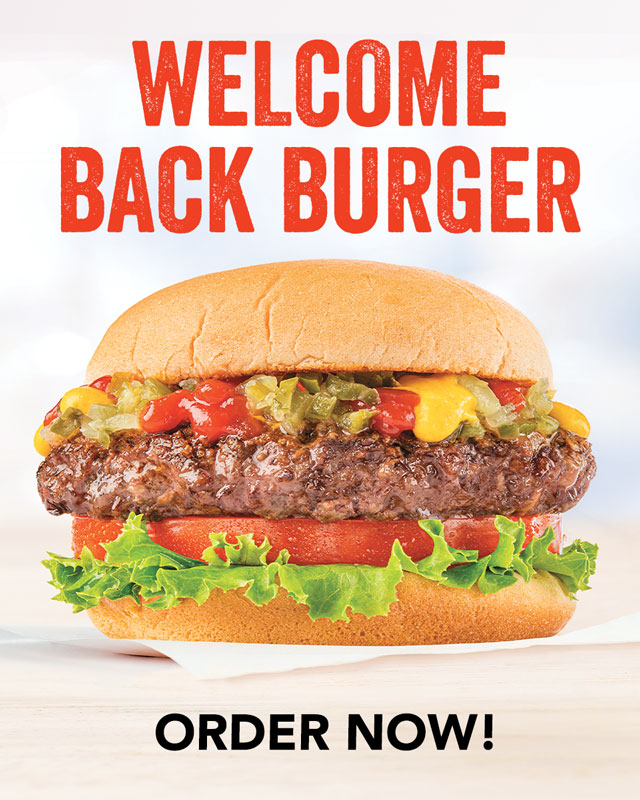

# My Burger Node Express Handlebars Application !

## License
   

  
   # Table of Contents

   * [Description](#Description)

   * [Runing a command-line application ](#Runing-a-command-line-application) 

   * [Installation Instructions](#installation-instructions)
  
   * [Usage Instructions](#usage-instructions)
  
   * [Contribution](#Contribution)
  
   * [Developers Contact Information](#Developers-Contact-Information)

   * [License](#license)

   # Description

   * This application is developed to create a burger logger with mysql, Node, Express,Handlebars by ORM and follows MVC design patterns. to view and interact with information stored it includes Node Mysql to query that can be used to route data in the app, write clearly and briefly, save, and delete database.
   * This application uses an express backend and save and retrieve node data from a mysql. 
   * I included in package.js as dependence

   * npm init

   * npm install express

   * npm install express-handlebars

   * npm install mysql

   * npm handlebars

   * npm method-override

   * body-parser

   * users can quickly and easily input the names of burgers they'd like to eat.

   * Whenever a user submits a burger's name, it displays the burger on the left side of the page -- waiting to be devoured. 

   * Each burger in the waiting area also has a `Devour it!` button. When the user clicks it, the burger moves to the right side of the page.

   * My app stores every burger in a database, whether devoured or not.

   #  Runing a command-line application 

   * You can Update orders.
   * You can View the orders by its id.
   * You can Delete the orders .

   * You can View the stored burger in a database whether devoured or not.

   * The app runs as a `nodemon server.js or node server.js` to gather information about each order. 

   * My burger node express handlebars application includes all necessary code that is readable, reliable, and maintainable Oftentimes, node_modules,  main Readme, screenshot images.

   * I put my LinkedIn profile, my github URL repository, heroku url and email address working activly.

   ## Installation Instructions

   * The developer is authorizing a free installation by cloning from the repository code:- 

   * [destish21/burger](https://github.com/destish21/burger)

   * you can run by install npm i to include node_module, express,express-handlebars and mysql.

   * you can run by node `nodemon server.js or by node server.js` to burger.

   # screenshot Images
   * 

   * 
   
   * 

   * 

   ## Usage Instructions

   * For this app to run make sure first:-

   * creat repository in your github, then clone the code from my github repository,

   * [destish21/burger](https://github.com/destish21/burger)

   * Install all necessary  node_moduales like express, express-handlebars, and mysql.

   * Make sure node_modules run by `npm i or npm install`
     in your computer.

   * Once in the directory run npm install to install the node_modules needed to run the app.
    Run by  `node server.js or by nodemon server.js` in your computer command line.

   * You can order your burger yummy! on the application.

   * A `myburger app!!`  will be desplayed after you ordered your burger yummy!. 

   * you can manage you orders easly.

   * I built with diferent package to connect to my MySQL database and perform requeries `db` file and return all files.

   * InquirerJs package to interact with the user via the command-line.

   * you can to be able to order and save databases.

   * you can to be able to delete and Update  you've ordered before.

   * you can  quickly access to emails and GitHub profiles.

   * My `my burger` is in my github repository enjoy it!

   * burger logger image Referece Google
 
   
    
   ## Contribution
  
   * This is Contributed by [destish21/burger](https://github.com/destish21/burger). 
   
   * But Contribution, issues and feature requests are welcome.
   * Feel free to check issues page if you want to contribute. 
   * you can contact me by Contact Information here below.

   ## Developers Contact Information
   * LinkdIn Profile : [Desta Mulualem](https://www.linkedin.com/in/desta-mulualem-6718b1203/)
   * Deployed URL : [myburger12](https://myburger12.herokuapp.com/burgers)
   * github URL :  https://github.com/destish21/burger

   * Email : destish21@yahoo.com
   
   # Desta Mulualem. All Rights Reserved © 02/16/2021.
